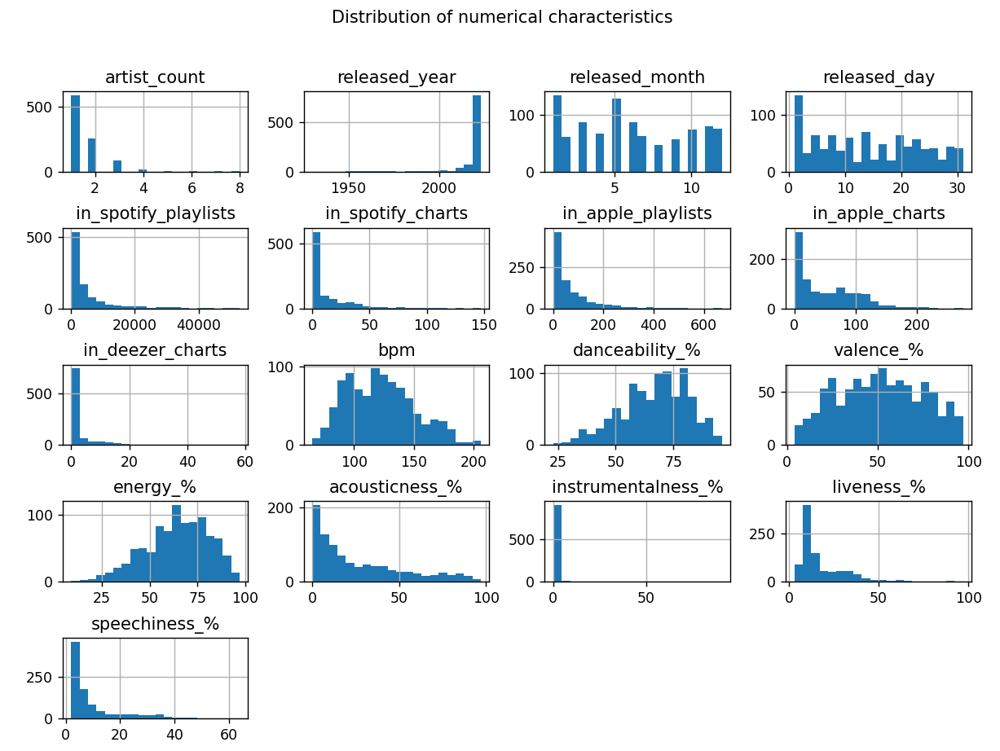
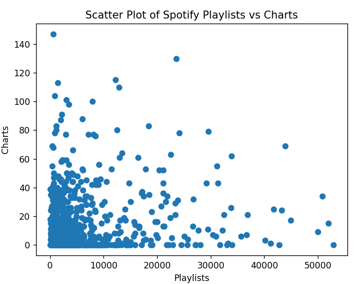
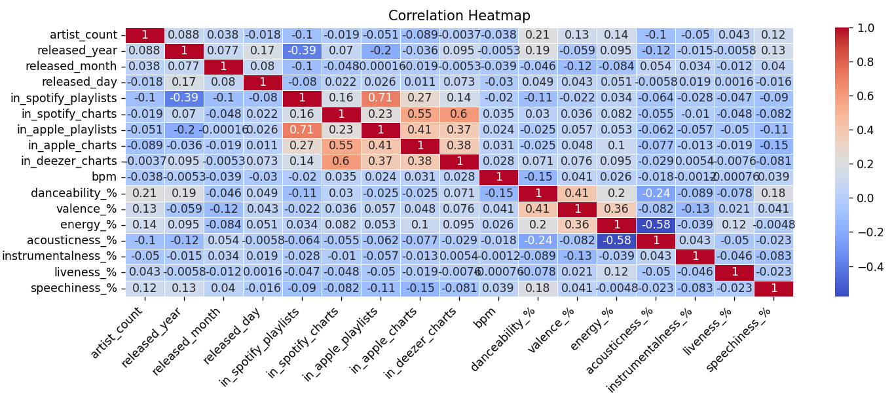
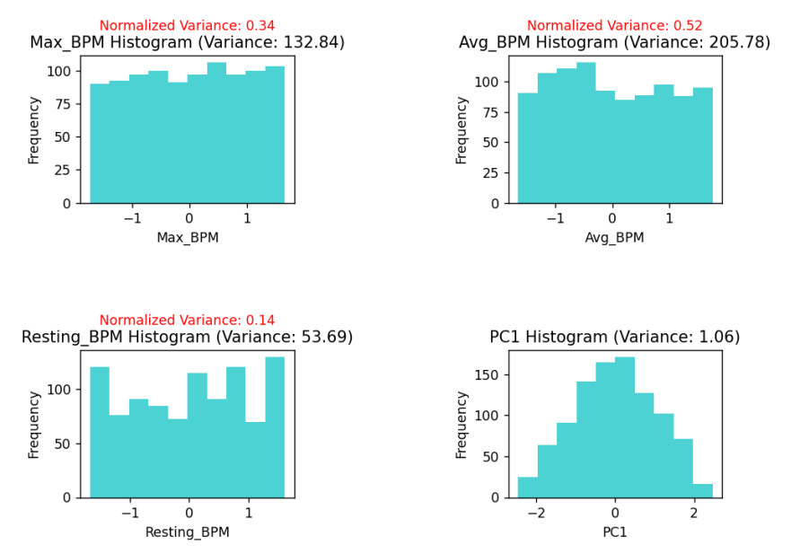
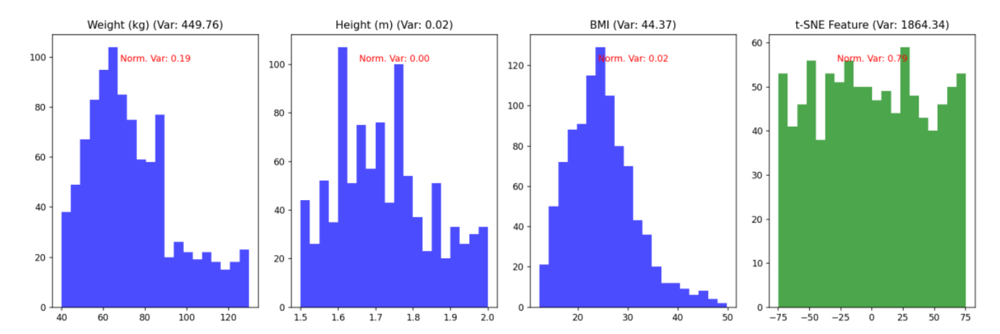
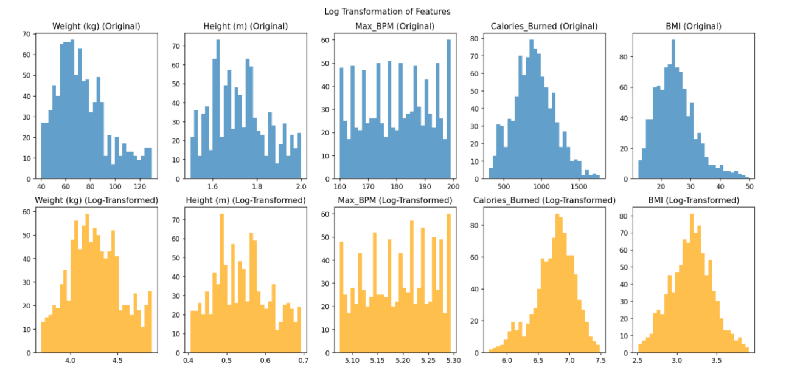
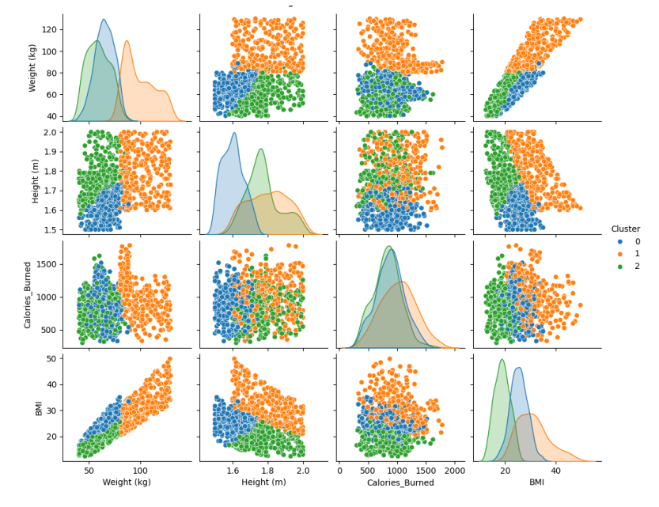
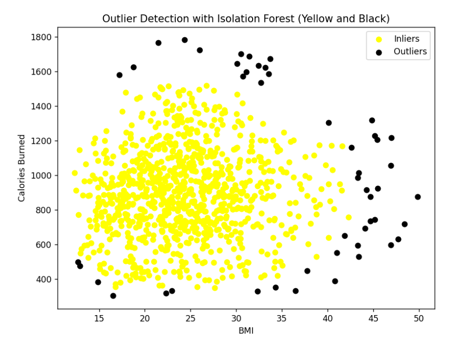

# Introuction to Machine Learning and Data Science Tasks

Reports in pdf format are included for both tasks and project

## Task 1: Exploratory Data Analysis

In this task we will extract and analyze data from a csv file that contains information about the most streamed Spotify songs in 2023

This task will include:
  - Analysis of features with calculations of statistics of features (eg. mean, median, variance)
  - Plots illustrating features and relations between them
  - Find interesting insights eg. trends, relations
  - Statistical tests on features eg. Shapiro-Wilk test, T-test, Chi Squared test
  - Correlation analysis
  - Creating new features / columns
  - Finding missing values and check where they are

Some Screenshots of this task (report includes more detailed information):

Distribution:

Scatter Plot:

Correlation HeatMap:

## Task 2: Feature engineering + Clustering + Outlier detection

In this task we will extract data from a csv file that contains information about gym members exercise tracking, and will apply the following procedures:

Dimension reduction:
  - PCA
  - t-SNE

Feature selection:
  - Variance Thresholding
  - SelectKBest
  - Chi2
  - R_regression
  - SelectFromModel

Feature preprocessing:
  - Normalization
  - Standardization
  - Scaling
  - Encoding categorical features
  - Discretization

Clustering:
  - KMeans
  - DBSCAN
  - Gaussian Mixture

Outlier detection:
  - OneClass SVM
  - Local Outlier Factor
  - Isolation Forest

Some screenshots of the task:

PCA reduction -> new feature:

t-SNE reduction -> new feature:

Scaling using logarithmic method:

Clustering using K-means algorithm:

Detecting outliers using isolation forest algorithm:

## Task 3: Classification, Regression and Metrics

Classification models used to predict the column Experience_Level:
  - K-Nearest Neighbors (KNN)
  - Decision Tree Classifier
  - Random Forest Classifier
  - Support Vector Machine (SVM)
  - Naive Bayes
Metrics used to evaluate the models:
  - Confusion Matrix
  - Precision
  - Recall
  - F1-Score
  - Accuracy
  - AUC (Area Under the ROC Curve)
  - ROC Curve

Regression models used to predict the column Calories_Burned:
  - Linear Regression
  - Polynomial Regression
  - Support Vector Regression (SVR)
  - Decision Tree Regressor
  - Random Forest Regressor
  - Ridge Regression
  - Lasso Regression
Metric used to evaluate the models: MAE, MSE, RMSE, R²
Residual plots where also used to visualize the performance of the models.

Some examples of Classification models performance:
