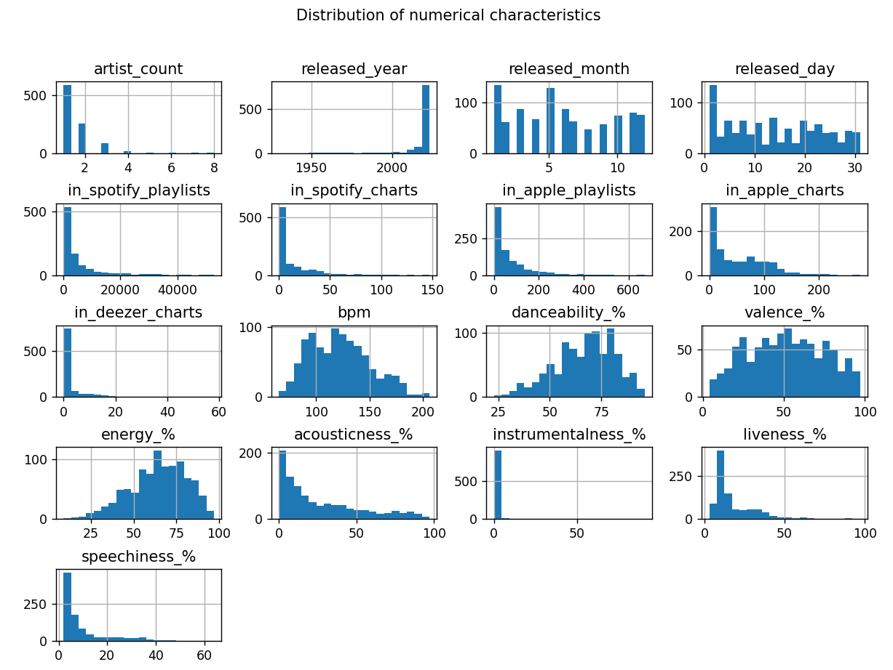

# Introuction to Machine Learning and Data Science Tasks

Reports in pdf format are included for both tasks and project

## Task 1: Exploratory Data Analysis

In this task we will extract and analyze data from a csv file that contains information about the most streamed Spotify songs in 2023

This task will include:
  - Analysis of features with calculations of statistics of features (eg. mean, median, variance)
  - Plots illustrating features and relations between them
  - Find interesting insights eg. trends, relations
  - Statistical tests on features eg. Shapiro-Wilk test, T-test, Chi Squared test
  - Correlation analysis
  - Creating new features / columns
  - Finding missing values and check where they are

Some Screenshots of this tasks (report includes more detailed information):

